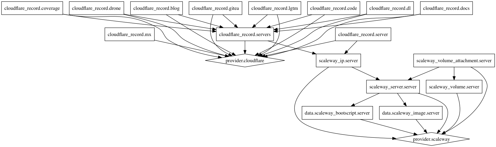

# Gitea: Infrastructure

[](https://discord.gg/NsatcWJ)

This repository presents the used scripting to setup our entire infrastructure
used within the Gitea development. Feel free to use it or to improve it.
We would be happy if you also brings back improvements to our infrastructure.

## Docs

* [Labels](docs/LABELS.md)

## Terraform



## Contributing

Fork -> Patch -> Push -> Pull Request

## Authors

* [Maintainers](https://github.com/orgs/go-gitea/people)
* [Contributors](https://github.com/go-gitea/infrastructure/graphs/contributors)

## License

This project is under the Apache-2.0 License. See the [LICENSE](LICENSE) file
for the full license text.

## Copyright

```
Copyright (c) 2016 The Gitea Authors <https://gitea.io>
```
